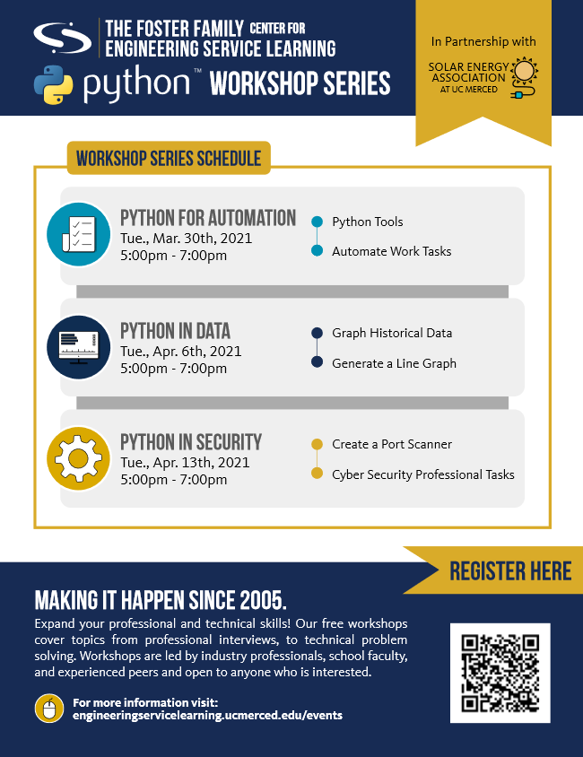

# 2021 Python Programming Workshops

This repository contains all of the materials needed for the 2021 Python Programming Workshops at the University of California, Merced, made possible through a partnership between Engineering Service Learning and the Solar Energy Association at UC Merced.

These workshops aim to teach the fundamentals of computer programming to beginners through a series of hands-on projects. Attendees are encouraged to focus on the **logic** behind these projects as opposed to being focused solely on the programming language itself.

## Workshop Schedule

The following flyer was created by Engineering Service Learning. All times are in Pacific Time.

## Workshop Instructions

Please click on a workshop to go to the instructions associated with the workshop.

[Workshop 1: Automate Work Tasks](https://github.com/shawnduong/2021-UCM-ESL-Python-Workshop/blob/main/Workshop_1/README.md)
