# Workshop 1: Automate Work Tasks

Let's suppose that you've been tasked with updating the company's contacts list as a spreadsheet. Although you *could* go through webpage after webpage of mindless, boring, zombie-brained data entry for days and days, you would much rather make a computer do it for you.

**Objective:** use logical thinking to create an algorithm that compiles contacts into a spreadsheet. We want the following information:

| Last Name | First Name | Company       | Phone Number    |
|-----------|------------|---------------|-----------------|
| Doe       | John       | Carroll Group | +1-202-555-0143 |
| Doe       | Jane       | Kemmer LLC    | +1-202-555-0727 |
| ...       | ...        | ...           | ...             |

**Disclaimer:** all person names and company names are generated from [fakedetail.com](https://fakedetail.com/) and all phone numbers are generated from [fakenumber.org](https://fakenumber.org/). These are **not** real details.

The website [shawnd.xyz/assets/misc/2021-03-30/](https://shawnd.xyz/assets/misc/2021-03-30/) contains a list of URLs to the contacts pages for individual companies.

## General Instructions

This gives an overall big picture idea of what to do. For step-by-step instructions, scroll to the next section.

1. You will be **split** into groups. This is the instructions document. Read this document as a group.
2. Have one individual in the group start **screensharing**. Have this person open up `logic.txt` with Replit. They may need a Replit account. Replit allows you to program without having to install software on your own system.
3. Start **writing** an algorithm in the `logic.txt` file by using the following steps. These steps are *not* in order. It's your job as a group to figure out the order they go in by thinking logically!
   - Note: the answer checker can be very finnicky. For best results: copy and paste these lines into `logic.txt`.
   - Note: if you get stuck, or if something goes wrong, feel free to use the "Call for Help" feature on Zoom!

```
Make a list of all the individual URLs on the webpage.
A: While the list of URLs is not empty, continue. Else, stop the program.
Go back to step B.
C: Remove the finished URL from the list.
Read https://shawnd.xyz/assets/misc/2021-03-30/.
Remove them from the list of people.
Make a list of all the individual contacts in the URL.
Go to a URL in the list.
Go back to step A.
Go to a person in the list of people.
Add their contact information to the spreadsheet.
B: While the list of people is not empty, continue. Else, go to step C.
```

4. After you're done, **click "Run."** The answer checker will see if your answer is correct, and then it will assemble your program and run it.

5. You can **view** your results in `contacts.csv`.

6. After you're done, **reflect** with your group.

7. If you're feeling courageous, feel free to have a look into `assembled_program.py` if you want to see the code you created. It's important to become comfortable reading code and seeing how *our logic* translates to *source code.*

8. Thanks for attending! You may leave the workshop whenever you'd like. We hope you learned something new and we hope to see you again next week!

## Step-by-Step Instructions

1. Go to [repl.it](http://repl.it/) and sign up for an account.

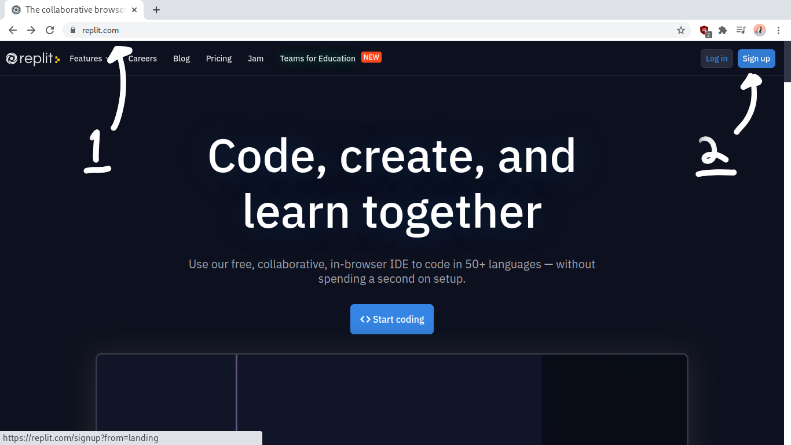
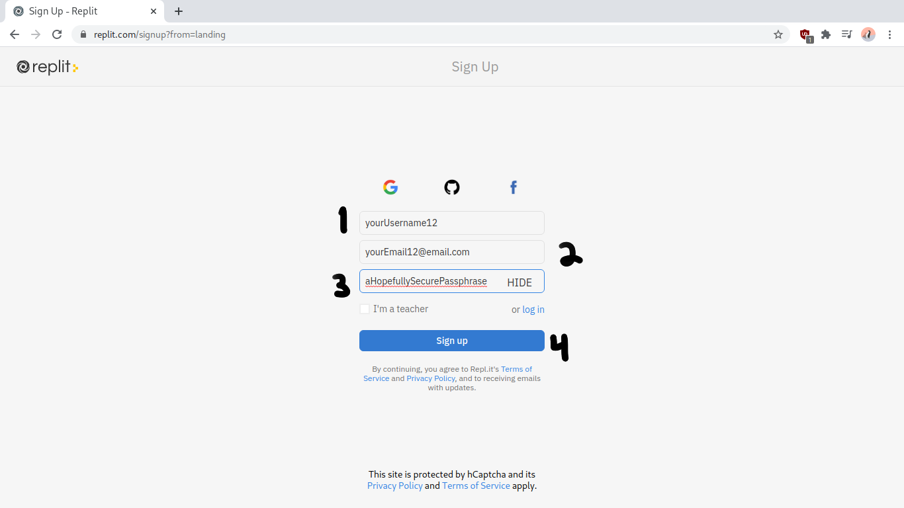

2. Once you have an account, click on "New repl."

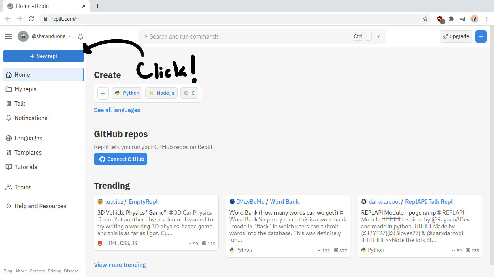

3. Select "Import from GitHub", paste in `https://github.com/shawnduong/2021-UCM-ESL-Python-Workshop` (this will automatically format to `shawnduong/2021-UCM-ESL-Python-Workshop), and then click "Import from github."

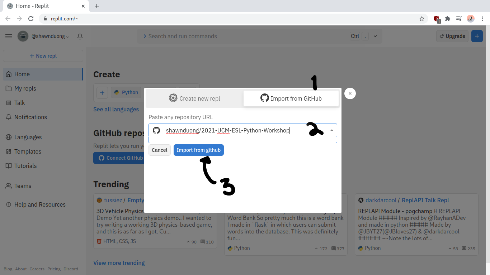

4. Set the language to "Python."

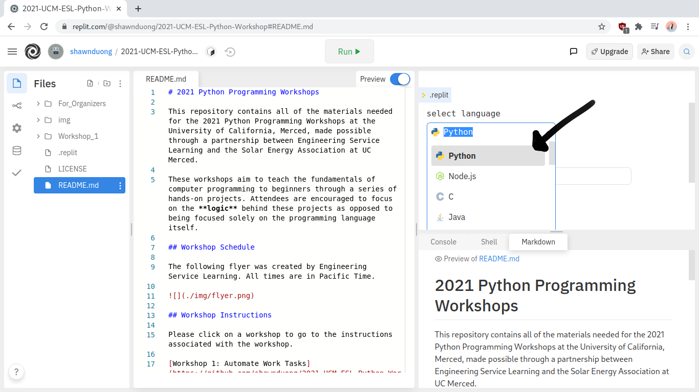

5. Under "configure the run button," type in the following string: `cd Workshop_1; python main.py`. Be careful! Remember that it is case sensitive and that `Workshop_1` has an underscore!

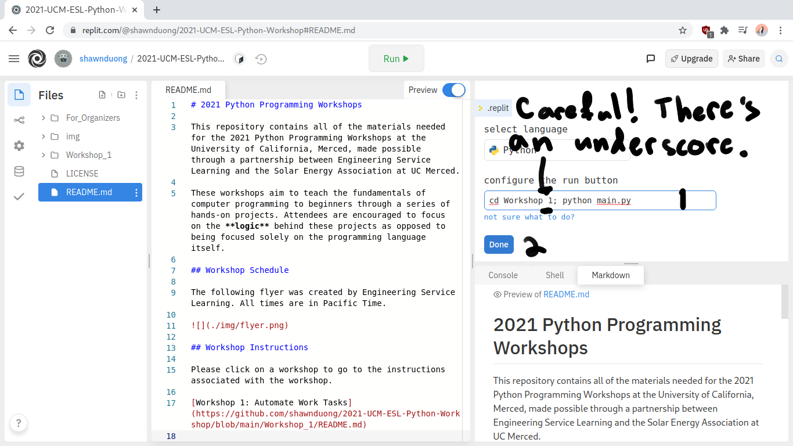

6. Expand the "Workshop_1" directory on the left and then select `README.md`. You now have a copy of these instructions conveniently in your environment so that you don't have to constantly switch windows or tabs!

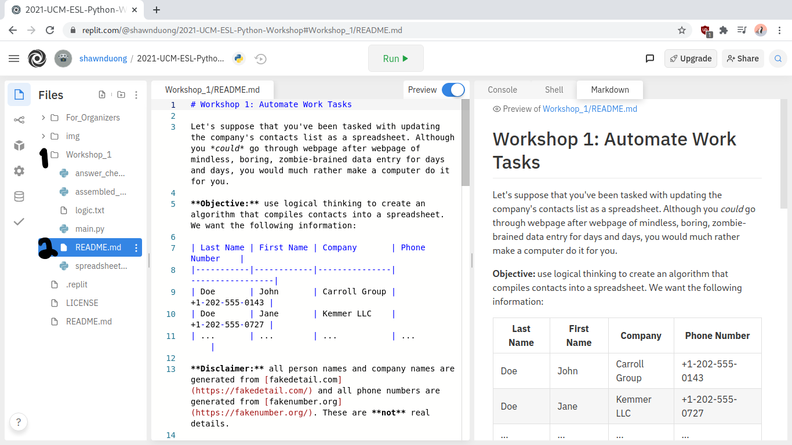

7. Select `logic.txt`. Fill out the text file with the logic of the program. We have a bunch of instructions, but they're *scrambled,* and it's up to you and your group to order them and unscramble them! Don't bother typing out the instructions by hand -- just copy and paste them by the line. When you think you've assembled the correct logic, select "Run."

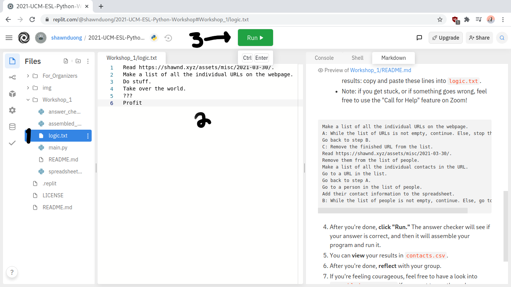

8. The terminal on the right will give you some feedback on your logic, and it will check to see if anything is wrong. If the logic is **correct**, then the assembled program will start running.

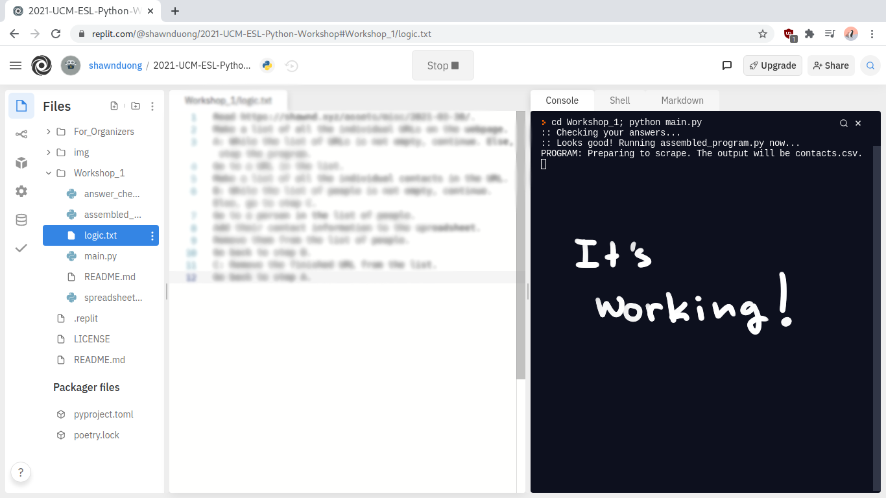

9. You can view the raw **output** of your assembled program by expanding the "Workshop_1" directory and selecting "contacts.csv."

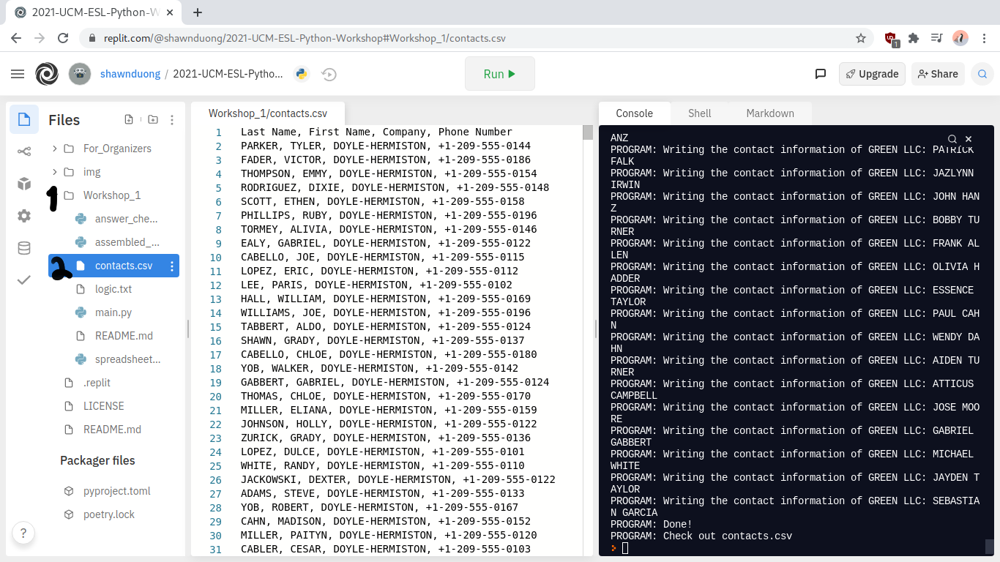

10. If you want to view the spreadsheet in a spreadsheet viewer like Excel or ONLY Office, then you can download the files as a ZIP. Unzip the downloaded file and open up the `contacts.csv` file with your program of choice.

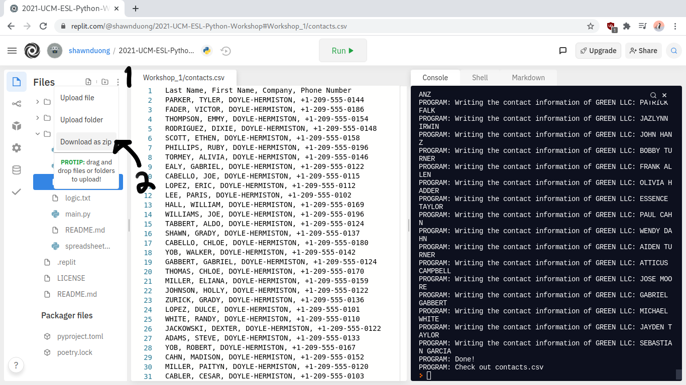

11. If your spreadsheet viewing program asks, the delimiter is a **comma.** After that, you can resize the columns and view the results!

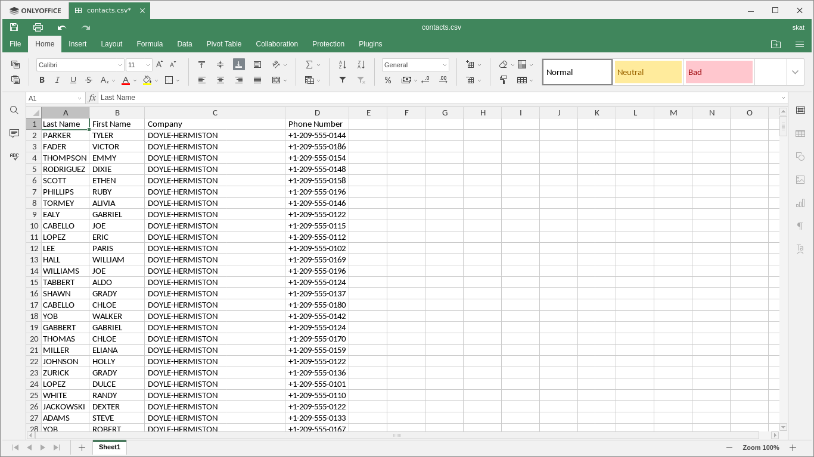

12. After you're done, **reflect** with your group.

If you're feeling courageous, feel free to have a look into `assembled_program.py` if you want to see the code you created. It's important to become comfortable reading code and seeing how *our logic* translates to *source code.*

Thanks for attending! You may leave the workshop whenever you'd like. We hope you learned something new and we hope to see you again next week!

## Final Thoughts

We just created an algorithm that does in only a few *seconds* what would take a person *hours* to do! This workshop was based on my real-life experiences automating tasks using Python. Tasks that would usually take 30 hours or more can be done in 30 seconds or less using a script that would take me take 30 or so minutes to write.

If you can think like a programmer and think *logically* and *algorithmically,* then computer programming may be something you want to look into more seriously. In future workshops in this series, we will be exploring more contexts where computer programming can prove to be useful.

That's the end of Workshop 1: Python for Automation. Hope to see you next week. Have a great night!
