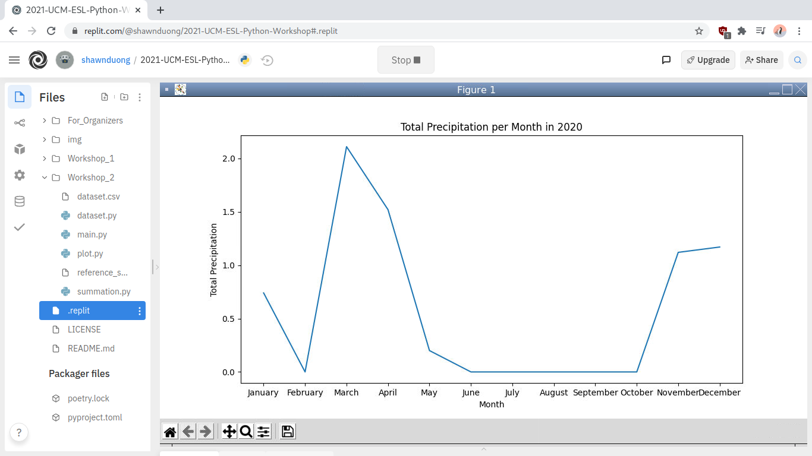

# Workshop 2: Generate a Line Graph

Let's suppose that you're studying weather patterns over a short duration of time. You'd like to create a visual to help yourself and others understand precipitation trends in the year of 2020. A line graph is ideal, and luckily for you, the `matplotlib` library in Python is capable of generating such data visualizations!

**Objective:** use `matplotlib`, a Python plotting library, to generate a line graph of total monthly precipitations in Merced, California, in the year of 2020.

**Disclaimer:** this is real data kindly provided by the National Oceanic and Atmospheric Administration (NOAA).

## Resources

Last week, we pieced the logic of a program together in English. This week, we're going to start writing Python code! This is a big step we're taking. As programmers, we do not **memorize** how to write code, but instead we **understand** how to **apply** a programmatic problem-solving mindset to create solutions. Good programming is about application, not memorization.

The following resources and references may be of great help to you:

- [Workshop: Python Reference Sheet](./reference_sheet.md)
- [matplotlib: Website](https://matplotlib.org/)
- [matplotlib: Documentation](https://matplotlib.org/stable/contents.html)
- [GeeksforGeeks: Line Chart in Matplotlib](https://www.geeksforgeeks.org/line-chart-in-matplotlib-python/)

Just like last workshop, I'll be hopping around breakout rooms to give guidance, help you along the way, and answer questions. Feel free to push the "Ask for Help" button on Zoom.

## Step-by-Step Instructions

1. You will be **split** into groups. This is the instructions document. Read this document as a group.

2. Go to the repl that you created last week for Workshop 1.

3. Select "Console" and type in `git pull`. Hit enter. This will synchronize your repl and download all of the new Workshop 2 materials.

4. Select the `.replit` file and change `Workshop_1` to `Workshop_2`. This will configure the "Run" button to run Workshop 2 instead of Workshop 1.

5. Expand the `Workshop_2` directory and open up `summation.py`. Complete activity #1 as a group.

6. Open up `plot.py`. Complete activity #2 as a group.

7. Once you're done with both activities, click the "Run" button at the top of the page. It will start running the program and it will turn into a "Stop" button.

8. You can view the final product in the new window that will appear. You can resize this window so that you can get a better view of the output graph.

9. Congratulations and good job! You just wrote real, working Python code and explored a very valuable application of Python: data. 

Thanks for attending! You may leave the workshop whenever you'd like. We hope you learned something new and we hope to see you again next week!
