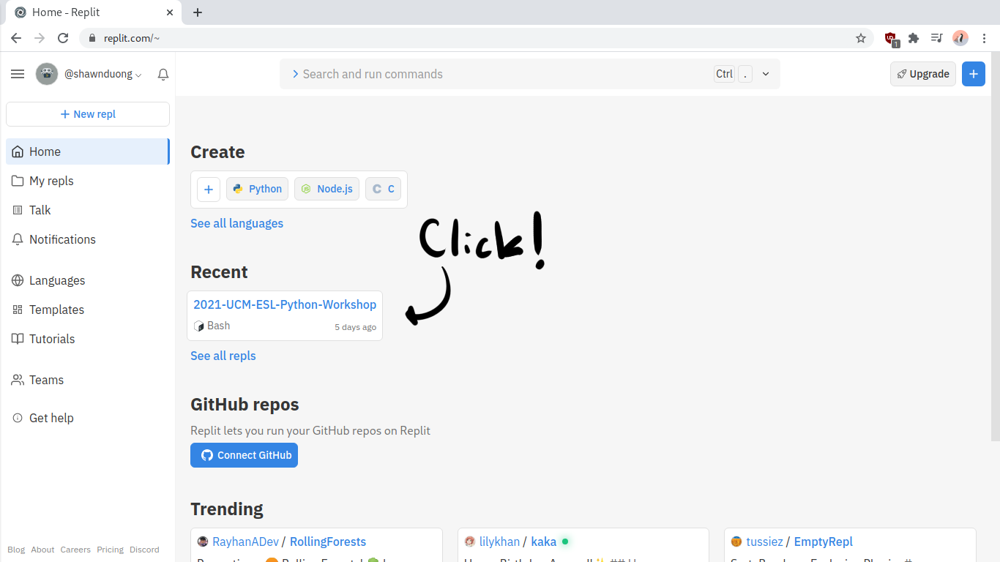
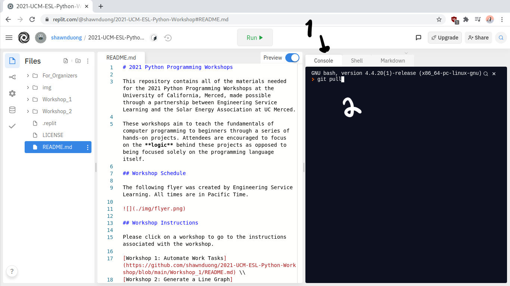
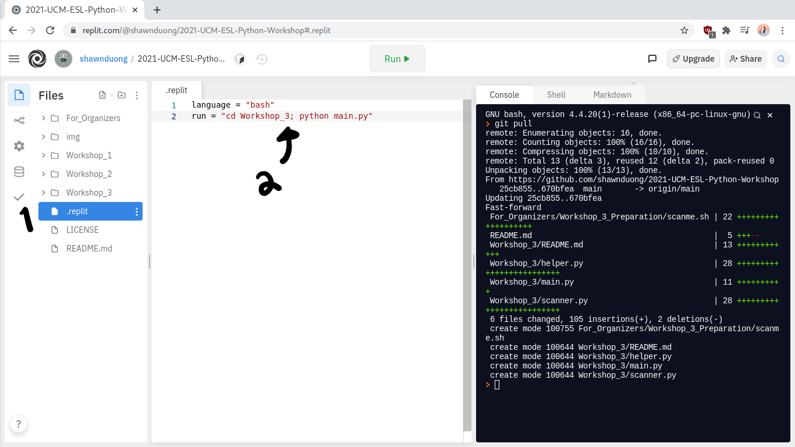
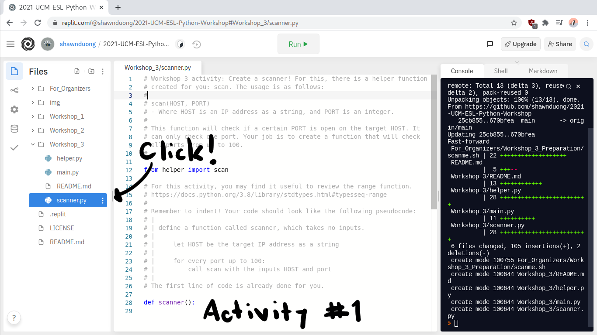
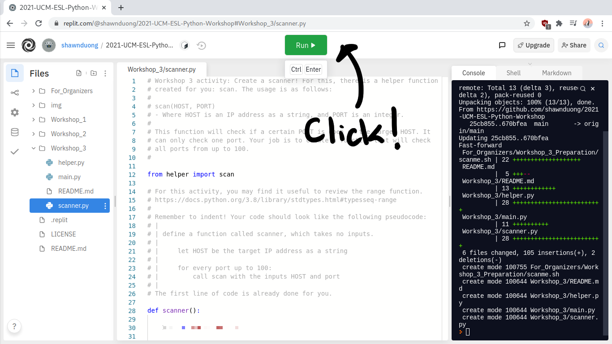
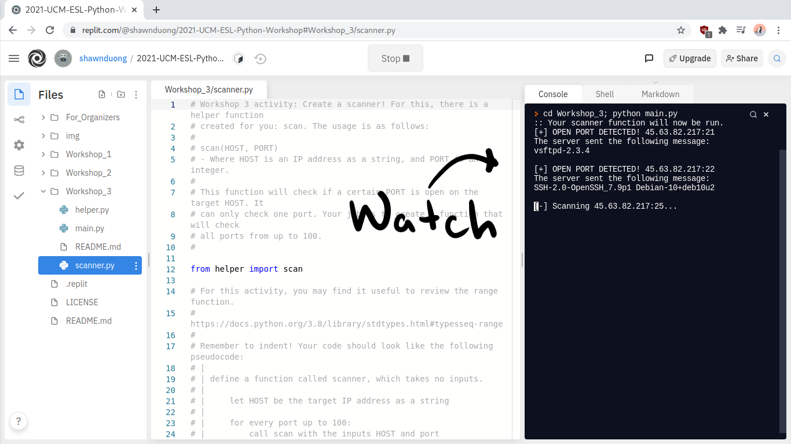
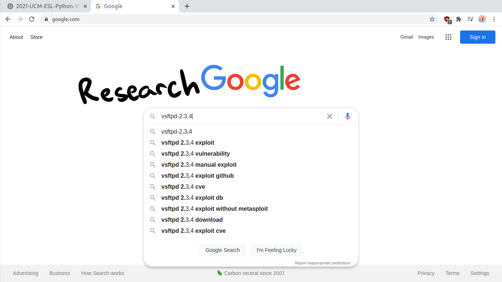

# Workshop 3: Creating a Port Scanner

Let's suppose that you work for a cybersecurity firm, and a client has recently hired your company to audit the security of one of their servers. One of the things on your checklist is to scan the server to find out what services are running on it in addition to the versions of said services. You could manually try connecting to each port on the target, but instead, you decide to make a tool to do this using Python.

**Objective:** use Python to write a port scanner that will discover services on the target server. Find out which services are vulnerable on the target server.

**Disclaimer:** the IP address of the target will be given through the Zoom call during the workshop. This is a safe target server set up by the organizers of the workshop for attendees to scan. **You have legal permission to scan this target.** This workshop provides a controlled lab environment. In the real world, please do not scan targets you do not have written permission for.

## Scope

You may scan the target whose IP address was given during the Zoom call. You can scan all the ports on this target, but there's no point scanning beyond TCP port 100 as all open services on the target machine have a port less than 100.

## Step-by-Step Instructions

1. You will be **split** into groups. This is the instructions document. Read this document as a group.

2. If you **did not** attend Workshops 1 or 2, then please go [here](https://github.com/shawnduong/2021-UCM-ESL-Python-Workshop/tree/main/Workshop_1#step-by-step-instructions) and follow **steps 1 through 4 of that manual,** and then proceed to **step 5 of this manual.** This will get you set up with a development environment and the files for this workshop. If you **did** attend Workshops 1 or 2, then please continue to step 3 as we will just be updating the environment you already have.

3. Go to the repl that we've been using for the last 2 workshops.

4. Select "Console" and type in `git pull`. Hit enter. This will synchronize your repl and download all of the new Workshop 3 materials.

5. Select the `.replit` file and change it to say `run = "cd Workshop_3; python main.py"`. This will configure the "Run" button to run Workshop 3.

6. Expand the `Workshop_3` directory and open up `scanner.py`. Complete the activity as a group. Remember that the target host is the IP address given during the Zoom call. If you need it again, then please push the "Ask for Help" button on Zoom. **It is important that you scan this host, and not another host that you *don't* have written permission for.**

7. After you're done writing your program, click "Run" to run your program. Then, watch the output in the terminal.

8. If your program has worked, then you will now be able to see some responses from the server. These are port numbers and the services running on those ports, as well as their versions. Now, do research on each service and version that you found in order to find out which port/service is vulnerable to a cyberattack.

9. Congratulations and good job! You just wrote Python code that scans a target for vulnerabilities based on the services running on the target's open ports. This is an incredibly important task that real cybersecurity professionals perform, which you also just did in a controlled lab environment.

Thanks for attending! This was the final workshop in a series of three made possible by the Solar Energy Association and Engineering Service Learning at UC Merced. You may leave the workshop whenever you'd like. We hope you learned something new and we hope that you enjoyed these workshops!
